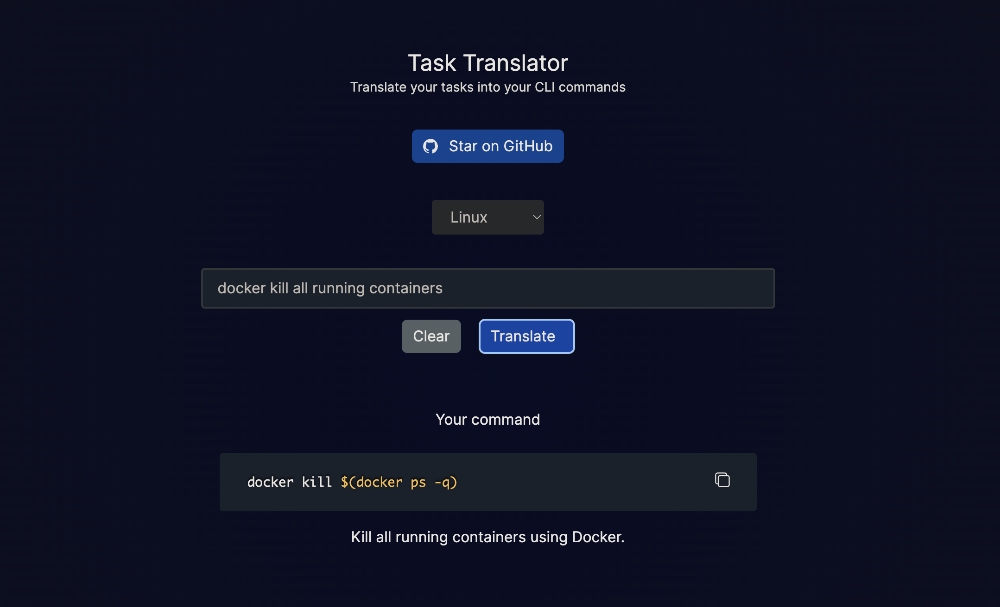

# Task Translator



## Description

This is a simple tool to generate CLI commands from natural human language. The tool generates commands for general tasks such as creating files, directories, and more. Linux, Mac, and Windows are supported.

## Caution ⚠️

This tool is not intended to be used as a tool to generate commands for production use. It is intended to be used as a tool to help people learn how to use the command line.

## Contributing

Contributions are welcome!

### Clone

Clone this repo to your local machine using:

```bash
git clone https://github.com/tasnimzotder/task-translator.git
```

### Installation

Use the package manager [yarn](https://yarnpkg.com/) to install the dependencies.

```bash
yarn install
```

### Set up the environment variables

Create a `.env` file in the root directory and add the following environment variables:

```bash
OPENAI_API_KEY=<your-openai-api-key>
```

### Start the development server

```bash
yarn dev
```

## License

The project is licensed under the MIT license.
